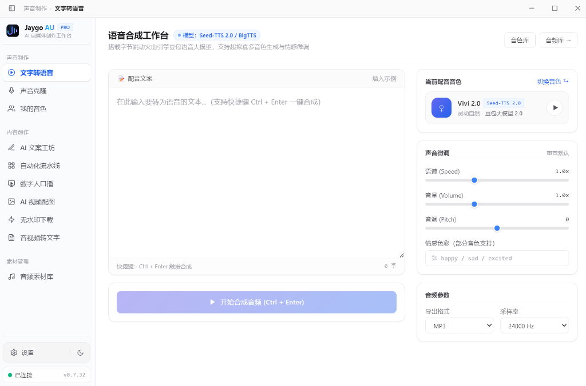
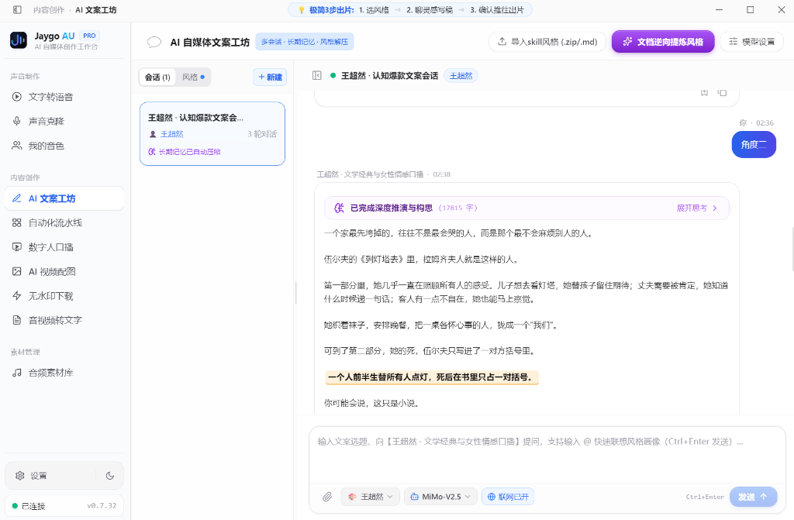
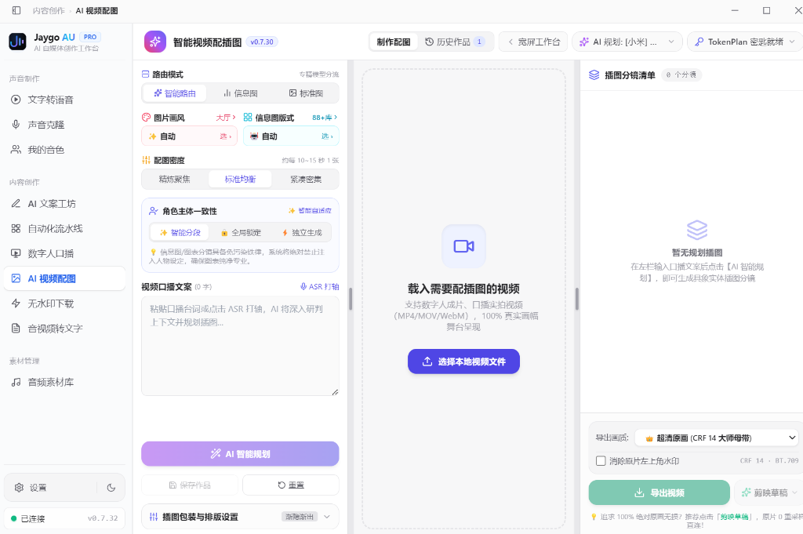

# Jaygo AU · 全能 AI 自媒体创作工作台

<p align="center">
  
</p>

<p align="center">
  <strong>一站式自媒体视听创作工作台，从声音复刻、多平台无水印提取到数字人出镜，驱动自媒体工业化生产。</strong>
</p>

<p align="center">
  <a href="https://ailabing.cn/jaygo-au.html">官方网站</a> •
  <a href="https://github.com/lj1270998580-crypto/JaygoAU-/releases/latest">GitHub Releases 下载 (v0.7.32)</a> •
  <a href="https://ailabing.cn/jaygo-au/updates/Jaygo.AU.Setup.0.7.32.exe">镜像高速下载</a> •
  <a href="https://github.com/lj1270998580-crypto/JaygoAU-">GitHub 仓库</a>
</p>

---

## 📖 简介

**Jaygo AU** 是一款面向自媒体创作者、短视频剪辑师、独立播客与内容出海团队的**全能 AI 视听创作桌面工作台**。

项目深度融合了 **字节跳动火山引擎（豆包语音大模型 Seed-TTS 2.0 / 声音复刻 Seed-Clone 2.0 / 录音识别 Seed-ASR 2.0）**、**商汤科技日日新（SenseNova）生图大模型**、**蝉镜（ChanJing）大模型数字人驱动** 以及 **全平台短视频与流媒体无水印智能解析引擎**，打破了传统自媒体创作中“录音难、复刻贵、文案提取繁琐、数字人工具分散、配图剪辑耗时”的痛点，帮助创作者实现从素材采集、声音克隆、口播生成、智能视频配图到剪映草稿工程直出的工业化闭环。

---

## 📸 真实界面展示 (UI Showcase)

### 🎙️ 1. 语音合成工作台（火山引擎豆包大模型 Seed-TTS 2.0 / BigTTS）
> 支持拟真多音色生成、情感微调、超低延迟流式试听与工业级多格式导出。



---

### ✍️ 2. AI 自媒体文案工坊（多轮深度思考 · 风格解析 · 爆款对齐）
> 搭载 MiMo-V2.5 深度推理引擎，支持从文档逆向提炼风格、长记忆上下文与自媒体爆款选题深度推演。



---

### 🎬 3. AI 智能视频配图与剪映联动（分镜规划 · 风格大厅 · 母带级无损导出）
> 智能识别视频台词语义，严格单图 ≤6s 防碰撞对齐，非信息图纯画面排版，支持剪映 Pro 官方草稿工程 100% 物理无损直出！



---

## ✨ 核心特性矩阵

### 1. 🎙️ 语音合成（Text to Speech）
- **双模大模型驱动**：明确接入 **豆包 Seed-TTS 2.0（高表现力）** 与 **BigTTS 1.0**，支持自然停顿与情绪张力。
- **全参数细腻调控**：内置快乐、严肃、激动、悲伤等丰富情感枚举及自由输入支持；语速（0.5x ~ 2.0x）、音量、采样率自由调节。
- **流式秒级响应**：NDJSON 流式极速生成，边接收边试听，超长文案无缝分块合成。

### 2. 🧬 声音复刻（Voice Cloning）
- **Seed-Clone 2.0 极速克隆**：仅需上传 **10~25 秒清晰单人人声**，即可秒级训练出高度拟真的专属数字人声音色。
- **自动状态轮询**：音色训练状态全自动轮询更新，完成后即刻解锁合成。
- **防误扣费安全提示**：严格遵循火山引擎机制，明确标注“首次调用合成转正收取槽位费”，保护创作者账户资产安全。

### 3. 🎭 蝉镜数字人工坊（Digital Human Studio）
- **形象与声音双驱动**：深度集成蝉镜数字人大模型 API，支持数字人形象挑选、文案口播合成与自定义音频驱动。
- **全流程云端渲染**：任务异步提交、实时进度百分比轮询、合成状态可视化提示。
- **数字资产闭环管理**：历史生成视频云端管理，支持一键在线播放、一键本地无损下载，并提供云端作品彻底删除功能。

### 4. ⚡ 媒体无水印提取（Media Extractor）
- **多平台智能支持**：覆盖 **抖音（Douyin）、哔哩哔哩（B站）、快手、小红书** 及通用音视频直链。
- **原生 Chromium 离屏渲染引擎**：内置独立无头渲染管线，自适应页面重定向与动态加载，原生截获纯净无水印 1080P/4K 高清视频与无损音轨。
- **智能口令文案清洗**：自动剔除包含标题、短标签、分享口令的冗余文字（如 `7.41 v@s.Rx... 复制此链接`），秒级提取有效目标短链。
- **智能分流与流转**：提取后支持一键本地另存为、直接在线试听，或 **一键推送到转录模块** 直接提取台词口播。

### 5. 📝 视音频智能转录（Smart ASR）
- **Seed-ASR 2.0 大模型识别**：接入火山引擎最新录音文件识别 2.0，准确率行业领先。
- **短视频链接直接转录**：支持直接粘贴抖音/B站/快手等短视频分享链接，工作台全自动在后台抽离音轨并直连转录。
- **本地多格式音视频直接解析**：支持拖拽本地 MP4、MOV、WAV、MP3 等多格式文件，内置 FFmpeg 智能音轨剥离。
- **智能标点与说话人分离**：自动生成精准标点分句，可选开启说话人声纹聚类分离（Speaker Diarization），文案脚本导出极速高效。

### 6. 🎬 AI 视觉导演 · 智能视频配图与剪映草稿无缝联动（AI Video Illustrator）
- **智能语义分镜规划**：基于大模型（通义千问 / DeepSeek / 豆包 / SenseNova / 自定义模型）智能理解视频台词语义，自动剔除商业促销推销用语，精准规划配图时序与关键画面。
- **画风全景参考大厅与 91+ 官方版式**：商汤官方实测真图所见即所得，包含水墨、油画、赛博、3D 黏土等 15 种艺术风格与 91 种信息图版式。
- **角色主体一致性锁与 3 选 1 并发变体**：智能锁定主角形象特征，单分镜支持一键生成 3 幅变体自由挑选，支持上传自定义垫图参考。
- **专业波形时间轴监视器**：画幅自适应贴合（杜绝 9:16 竖屏大黑边与插图错位），提供 1.0x ~ 15.0x 连续平滑缩放滑动条、高精刻度自适应与分镜卡片动态阶梯渲染。
- **剪映 Pro 专业草稿一键直出**：
  - 自动识别本地剪映草稿目录，一键无感写入完整剪映项目工程；
  - 官方内置原生动效（渐显/渐隐/放大/缩小/滑动）真实还原，无需用户手动调特效；
  - 预渲染白边与圆角透明通道 PNG，完美呈现卡片立体质感；
  - 严格时序防碰撞对齐，相邻片段留有呼吸安全间隙，锁定单轨纯净顺畅播放。

### 7. 🛡️ 工业级细节与现代桌面体验
- **侧栏品牌展厅 + 顶栏智能面包屑**：侧边栏恢复精致饱满的品牌展厅，顶栏彻底消除重复 Logo 并呈现当前模块智能面包屑导航；支持 `Ctrl + B` 自由折叠侧栏，折叠时顶栏自动平滑淡入 Mini Logo 保持品牌感知。
- **三层工作流清晰导航**：按「音频生产」、「视听创作」、「资产管理」科学归类，符合自媒体工业化制作习惯。
- **现代美学字体栈**：引入包含全中文字符集的 **思源黑体（Noto Sans SC）** 与西文 **Inter** 现代字体，告别宋体与陈旧排版。
- **系统托盘后台守护**：支持配置“关闭窗口最小化至系统托盘”，防止误操作关闭导致正在渲染的数字人或长文本转录任务中断。
- **实时账户余额监测**：内置火山引擎 AK/SK V4 签名鉴权，左下角动态轮询可用余额，悬停可查看现金/欠费/冻结明细。

---

## 🧱 技术架构与安全性

```
┌──────────────────────────────────────────────────────────┐
│  Renderer (React + Vite + Tailwind CSS + Zustand)        │
│  • 现代极简设计 / 思源黑体字体体系 / 可折叠侧栏布局         │
│  • 纯交互呈现，前端不持有任何明文 Key，杜绝泄露与安全隐患 │
└───────────────┬──────────────────────────────────────────┘
                │ window.JaygoAPI (严格 contextBridge 白名单)
┌───────────────▼──────────────────────────────────────────┐
│  Main Process (Electron 32 + Node.js 20)                 │
│  • 安全中枢：操作系统级 safeStorage (Windows DPAPI) 密钥加密│
│  • 离屏无头渲染引擎：无缝截获短视频平台无水印流媒体         │
│  • 任务生命周期管理：FFmpeg 离线音轨抽取 / 托盘事件监听      │
│  • 阿里云 OSS 极速暂存调度（任务结束即刻销毁，无数据残留）  │
│  • 所有外部 API 请求在此完成，天然绕过浏览器 CORS 跨域限制 │
└───────────────┬──────────────────────────────────────────┘
                │ HTTPS (X-Api-Key / AK-SK V4 签名 / Bearer Token)
┌───────────────▼──────────────────────────────────────────┐
│  云端核心服务矩阵                                         │
│  • 火山引擎豆包语音：Seed-TTS 2.0 / Seed-Clone 2.0 / Seed-ASR │
│  • 蝉镜数字人云端服务：形象查询 / 口播合成 / 渲染轮询      │
│  • 阿里云 OSS：音频识别高速临时中转通道                  │
└──────────────────────────────────────────────────────────┘
```

> **安全承诺**：用户填写的火山引擎 `X-Api-Key`、`AK/SK` 以及蝉镜 Token 均保存在本地系统加密密钥环中，**绝不上传到除服务商官方 API 以外的任何第三方服务器**。

---

## 📥 下载与安装

### Windows 推荐安装
- **GitHub Releases 最新版下载**：[Jaygo.AU.Setup.0.7.32.exe (GitHub Releases)](https://github.com/lj1270998580-crypto/JaygoAU-/releases/download/v0.7.32/Jaygo.AU.Setup.0.7.32.exe)
- **GitHub 所有发布版本**：[https://github.com/lj1270998580-crypto/JaygoAU-/releases](https://github.com/lj1270998580-crypto/JaygoAU-/releases)
- **国内镜像高速直链**：[Jaygo.AU.Setup.0.7.32.exe (ailabing.cn)](https://ailabing.cn/jaygo-au/updates/Jaygo.AU.Setup.0.7.32.exe)
- **官方发布页**：[https://ailabing.cn/jaygo-au.html](https://ailabing.cn/jaygo-au.html)
- **系统要求**：Windows 10 / 11（64-bit）

---

## 🛠️ 本地开发与构建

### 1. 环境准备
- [Node.js](https://nodejs.org/) (>= 18.0.0)
- npm 或 pnpm

### 2. 克隆与安装依赖
```bash
git clone https://github.com/lj1270998580-crypto/JaygoAU-.git
cd JaygoAU-
npm install
```

### 3. 启动本地开发
```bash
npm run dev
```

### 4. 生产包打包
```bash
# 校验 TypeScript 类型与前端构建
npm run build

# 打包输出 Windows NSIS 安装程序（位于 release/ 目录）
npm run dist
```

---

## 🔑 凭据配置指南

1. **火山引擎（豆包语音）**：
   - 登录 [火山引擎控制台 - 语音技术](https://console.volcengine.com/speech/new/overview?projectName=default)；
   - 在「API Key 管理」生成 `X-Api-Key`；
   - 在「访问控制 - API 访问密钥」生成 `AccessKey ID` 与 `AccessKey Secret`（用于账户余额实时查询）；
   - 确保开通了语音合成 2.0、声音复刻 2.0 及录音文件识别 2.0 服务。
2. **阿里云 OSS（可选，用于视音频转录）**：
   - 配置 Bucket、AccessKey ID 与 AccessKey Secret，工作台会在转录前暂存音频，并在转录任务发起后自动销毁文件。
3. **蝉镜数字人（可选，用于数字人视频生成）**：
   - 在设置中填入蝉镜 API Token 即可启用数字人制作工坊。

---

## 💰 官方资费参考说明

| 能力项 | 底层模型 | 计费单位 | 官方刊例参考价 |
| :--- | :--- | :--- | :--- |
| **语音合成 2.0** | 豆包 `seed-tts-2.0` | 元 / 万字符 | ¥5 / 万字符（资源包低至约 ¥2.8） |
| **声音复刻 2.0** | 火山 `seed-icl-2.0` | 元 / 万字符 | 免费训练，首次合成收取音色槽位费 |
| **录音识别 2.0** | 豆包 `Seed-ASR 2.0` | 元 / 小时 | ¥0.8 / 小时（1000小时包低至约 ¥0.9） |
| **蝉镜数字人** | 大模型数字人视频渲染 | 算力时长/点数 | 详见蝉镜官方计费标准 |

> *详细刊例价请在软件内点击「设置 → 官方价格说明」进行实时查阅。*

---

## 📄 开源许可证

本项目基于 [MIT License](LICENSE) 开源发布。欢迎提 Issue 与 Pull Request 共同完善！
